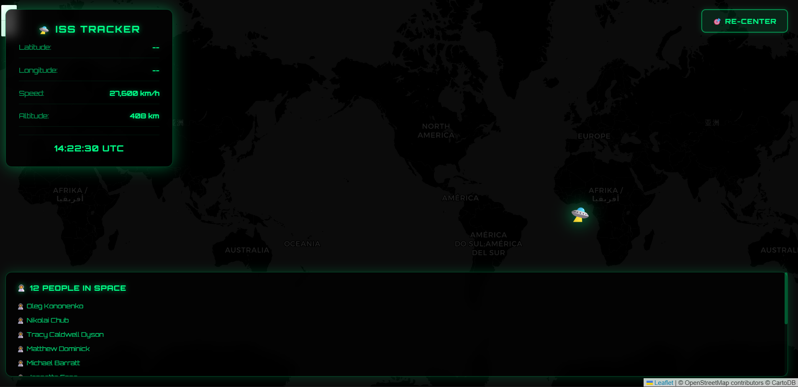

# 🛸 Real-time ISS Tracker

Track the International Space Station live as it orbits Earth at 28,000 km/h — updated every 2 seconds, right in your browser.

## 🚀 Live Demo

👉 [View it here](https://minajuddin0510.github.io/real-time-iss-tracker)

## 📸 Preview



## ✨ Features

- 🛸 Live ISS marker on a full screen dark interactive map
- 🔄 Position updates every 2 seconds automatically
- 🗺️ Map auto-recenters on the ISS every 5 seconds
- 🔵 Glowing trail showing the last 20 positions of the ISS
- 🎯 Re-center button to snap back to ISS if you pan away
- 📊 Live info panel showing latitude, longitude, altitude & speed
- 🕐 Live UTC clock
- 👨‍🚀 Shows exactly how many people are in space right now — with their names
- 💎 Glassmorphism panels with neon cyan glow
- 📱 Fully responsive — looks great on mobile too

## 🛠️ Built With

- HTML5
- CSS3 (glassmorphism, animations, neon glow)
- Vanilla JavaScript
- [Leaflet.js](https://leafletjs.com) — interactive maps
- [Open Notify API](http://open-notify.org) — free, no key needed
- [Orbitron Font](https://fonts.google.com/specimen/Orbitron) — Google Fonts

## 🔑 API Key

None needed! This project uses [Open Notify](http://open-notify.org) which is completely free and open — no signup, no credit card, nothing. ✅

## 🚀 Getting Started

### Option 1 — Open locally
```bash
git clone https://github.com/minajuddin0510/real-time-iss-tracker.git
cd real-time-iss-tracker
open index.html
```

### Option 2 — Live on GitHub Pages
1. Push `index.html` to your GitHub repo
2. Go to **Settings → Pages**
3. Set source to `main` branch, root folder
4. Live at `https://minajuddin0510.github.io/real-time-iss-tracker` 🎉

## 📁 Project Structure

```
real-time-iss-tracker/
├── index.html    # Everything in one file — HTML, CSS, and JS
└── README.md
```

## 📄 License

This project is open source and available under the [MIT License](LICENSE).

---

Made with 🛸 by **Minaj Uddin**
